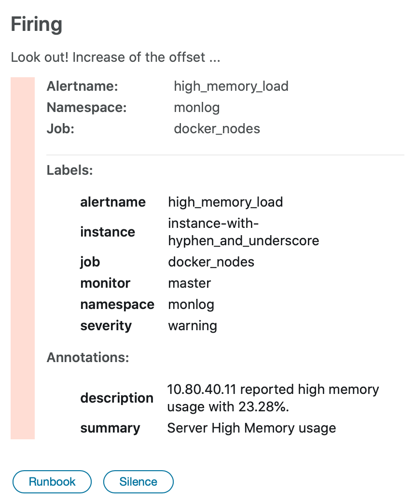
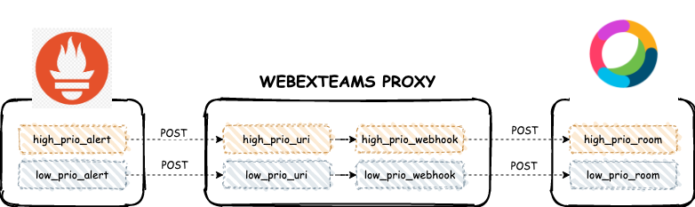

[](https://github.com/infonova/prometheus-webexteams/releases/)
[](https://travis-ci.org/infonova/prometheus-webexteams)
[](https://codecov.io/gh/infonova/prometheus-webexteams)
[](https://goreportcard.com/report/github.com/infonova/prometheus-webexteams)



# Overview

A lightweight Go Web Server that receives __POST__ alert messages from __Prometheus Alertmanager__ and sends it to a __Cisco Webex Teams Room__ using the Webex API.

## Synopsis

Alertmanager doesn't support sending to Cisco Webex Teams out of the box. Fortunately, they allow you to use a generic [webhook_config](https://prometheus.io/docs/alerting/configuration/#webhook_config) for cases like this. This project was inspired from [prometheus-msteams's](https://quay.io/repository/prometheusmsteams/prometheus-msteams) which was written in Go for Microsoft Teams.

## Table of Contents

<!-- vim-markdown-toc GFM -->
- [Getting Started (Quickstart)](#getting-started-quickstart)
  - [Installation](#installation)
  - [Setting up Prometheus Alert Manager](#setting-up-prometheus-alert-manager)
  - [Simulating a Prometheus Alerts to Teams Channel](#simulating-a-prometheus-alerts-to-teams-channel)
- [Sending Alerts to Multiple Teams Channel](#sending-alerts-to-multiple-teams-channel)
  - [Creating the Configuration File](#creating-the-configuration-file)
  - [Setting up Prometheus Alert Manager](#setting-up-prometheus-alert-manager-1)
- [Customise Messages to MS Teams](#customise-messages-to-ms-teams)
  - [Customise Messages per MS Teams Channel](#customise-messages-per-ms-teams-channel)
  - [Use Template functions to improve your templates](#use-template-functions-to-improve-your-templates)
- [Configuration](#configuration)
- [Kubernetes Deployment](#kubernetes-deployment)
- [Contributing](#contributing)

<!-- vim-markdown-toc -->

## Getting Started (Quickstart)

How it works.


### Installation

We always recommend to use the latest stable release!

__OPTION 1:__ Run using docker.

```bash
docker run -d -p 2000:2000 \
    --name="promteams" \
    -e TEAMS_ACCESS_TOKEN="NzhiODhlZDYtZTF..." \
    -e TEAMS_ROOM_ID="Y2lzY29zcGFyazovL3VzL1JPT00vYWZmMTllNTAtY..." \
    infonova/prometheus-webexteams
```

__OPTION 2:__ Run using binary.

Download the binary for your platform and the default card template from [RELEASES](https://github.com/infonova/prometheus-webexteams/releases), then run the binary in the same directory as you have stored the `default-message-card.tmpl`  like the following:

```bash
./bin/prometheus-webexteams-<goos>-<goarch> -teams-access-tocken "NzhiODhlZDYtZTF..." \
  -teams-room-id "Y2lzY29zcGFyazovL3VzL1JPT00vYWZmMTllNTAtY..."
```

__OPTION 3:__ If you are going to deploy this in a **Kubernetes cluster**, checkout the [Kubernetes Deployment Guide](#kubernetes-deployment).

### Setting up Prometheus Alertmanager

By default, __prometheus-webexteams__ creates a request uri handler __/alertmanager__.

```yaml
route:
  group_by: ['alertname']
  group_interval: 30s
  repeat_interval: 30s
  group_wait: 30s
  receiver: 'prometheus-webexteams'

receivers:
- name: 'prometheus-webexteams'
  webhook_configs: # https://prometheus.io/docs/alerting/configuration/#webhook_config 
  - send_resolved: true
    url: 'http://prometheus-webexteams:2000/alertmanager' # the prometheus-webexteams proxy
```

> If you don't have Prometheus running yet and you wan't to try how this works,  
> try [stefanprodan's](https://github.com/stefanprodan) [Prometheus in Docker](https://github.com/stefanprodan/dockprom) to help you install a local Prometheus setup quickly in a single machine.

### Simulating a Prometheus Alerts to Teams Room

Create the following json data as `prom-alert.json`.

```json
{
    "version": "4",
    "groupKey": "{}:{alertname=\"high_memory_load\"}",
    "status": "firing",
    "receiver": "teams_proxy",
    "groupLabels": {
        "alertname": "high_memory_load"
    },
    "commonLabels": {
        "alertname": "high_memory_load",
        "monitor": "master",
        "severity": "warning"
    },
    "commonAnnotations": {
        "summary": "Server High Memory usage"
    },
    "externalURL": "http://docker.for.mac.host.internal:9093",
    "alerts": [
        {
            "labels": {
                "alertname": "high_memory_load",
                "instance": "10.80.40.11:9100",
                "job": "docker_nodes",
                "monitor": "master",
                "severity": "warning"
            },
            "annotations": {
                "description": "10.80.40.11 reported high memory usage with 23.28%.",
                "summary": "Server High Memory usage"
            },
            "startsAt": "2018-03-07T06:33:21.873077559-05:00",
            "endsAt": "0001-01-01T00:00:00Z"
        }
    ]
}
```

```bash
curl -X POST -d @pkg/card/testdata/prometheus_fire_request.json http://<hostname|ip>:2000/alertmanager
```

The teams room should received a message.

## Sending Alerts to Multiple Teams Rooms

You can configure this application to serve 2 or more request path and each path can use a unique Teams room to post.



This can be achieved by supplying the application a configuration file.

### Creating the Configuration File

Create a yaml file with the following format.

```yaml
connectors:
  - request_path: high-prio-ch
    access_token: NzhiODhlZDYtZ...
    room_id: Y2lzY29zcGFyazovL...
    template_file: ./resources/default-message-card.tmpl
    webhook_url: https://webexapis.com/v1/messages
    escape_underscores: false
- request_path: low-prio-ch
    access_token: NzhiODhlZDYtZ...
    room_id: Y2lzY29zcGFyazovL...
    template_file: ./resources/default-message-card.tmpl
    webhook_url: https://webexapis.com/v1/messages
    escape_underscores: false

```

When running as a docker container, mount the config file in the container and set the __CONFIG_FILE__ environment variable.

```bash
docker run -d -p 2000:2000 \
    --name="promteams" \
    -v /tmp/config.yml:/tmp/config.yml \
    -e CONFIG_FILE="/tmp/config.yml" \
    infonova/prometheus-webexteams
```

When running as a binary, use the __-config-file__ flag.

```bash
./bin/prometheus-webexteams-<goos>-<goarch> -config-file /tmp/config.yml
```

This will create the request uri handlers __/high-prio-ch__ and __/low-prio-ch__.

To validate your configuration, see the __/config__ endpoint of the application.

```bash
curl localhost:2000/config

[
  {
    "RequestPath": "high-prio-ch",
    "AccessToken": "NzhiODhlZDYtZ...",
    "RoomId": "Y2lzY29zcGFyazovL...",
    "TemplateFile": "./resources/default-message-card.tmpl",
    "WebhookURL": "https://webexapis.com/v1/messages",
    "EscapeUnderscores": false
  },
  {
    "RequestPath": "low-prio-ch",
    "AccessToken": "NzhiODhlZDYtZ...",
    "RoomId": "Y2lzY29zcGFyazovL...",
    "TemplateFile": "./resources/default-message-card.tmpl",
    "WebhookURL": "https://webexapis.com/v1/messages",
    "EscapeUnderscores": false
  }
]
```

### Setting up Prometheus Alertmanager

Considering the __prometheus-webexteams config file__ settings, your Alert Manager would have a configuration like the following.

```yaml
route:
  ...
  routes:
    - receiver: high_prio_receiver
      match:
        severity: critical
    - receiver: low_prio_receiver
      match:
        severity: warning

receivers:
- name: 'high_prio_receiver'
  webhook_configs:
    - send_resolved: true
      url: 'http://<servicename>:2000/high_prio_ch' # request handler 1
- name: 'low_prio_receiver'
  webhook_configs:
    - send_resolved: true
      url: 'http://<servicename>:2000/low_prio_ch' # request handler 2
```

### Use Template functions to improve your templates

You can use

* all of the existing [sprig template functions](http://masterminds.github.io/sprig/) except the [OS functions env and expandenv](http://masterminds.github.io/sprig/os.html)
* some well known functions from Helm: `toToml`, `toYaml`, `fromYaml`, `toJson`, `fromJson`

## Configuration

All configuration from flags can be overwritten using environment variables.

E.g, `-config-file` is `CONFIG_FILE`, `-debug` is `DEBUG`, `-log-format` is `LOG_FORMAT`.

```
Usage of prometheus-webexteams:
  -config-file string
        The connectors configuration file.
  -debug
        Set log level to debug mode. (default true)
  -escape-underscores
        Automatically replace all '_' with '\_' from texts in the alert.
  -http-addr string
        HTTP listen address. (default ":2000")
  -idle-conn-timeout duration
        The HTTP client idle connection timeout duration. (default 1m30s)
  -jaeger-agent string
        Jaeger agent endpoint (default "localhost:6831")
  -jaeger-trace
        Send traces to Jaeger.
  -log-format string
        json|fmt (default "json")
  -max-idle-conns int
        The HTTP client maximum number of idle connections (default 100)
  -request-uri string
        The default request URI path where Prometheus will post to. (default "alertmanager")
  -teams-access-token string
        The access token to authorize the requests.
  -teams-room-id string
        The room specifies the target room of the messages.
  -teams-webhook-url string
        The default Webex Teams webhook connector. (default "https://webexapis.com/v1/messages")
  -template-file string
        The default Webex Teams Message Card template file. (default "resources/default-message-card.tmpl")
  -tls-handshake-timeout duration
        The HTTP client TLS handshake timeout. (default 30s)
  -version
        Print the version
```

## Kubernetes Deployment

See [Helm Guide](./chart/prometheus-webexteams/README.md).
